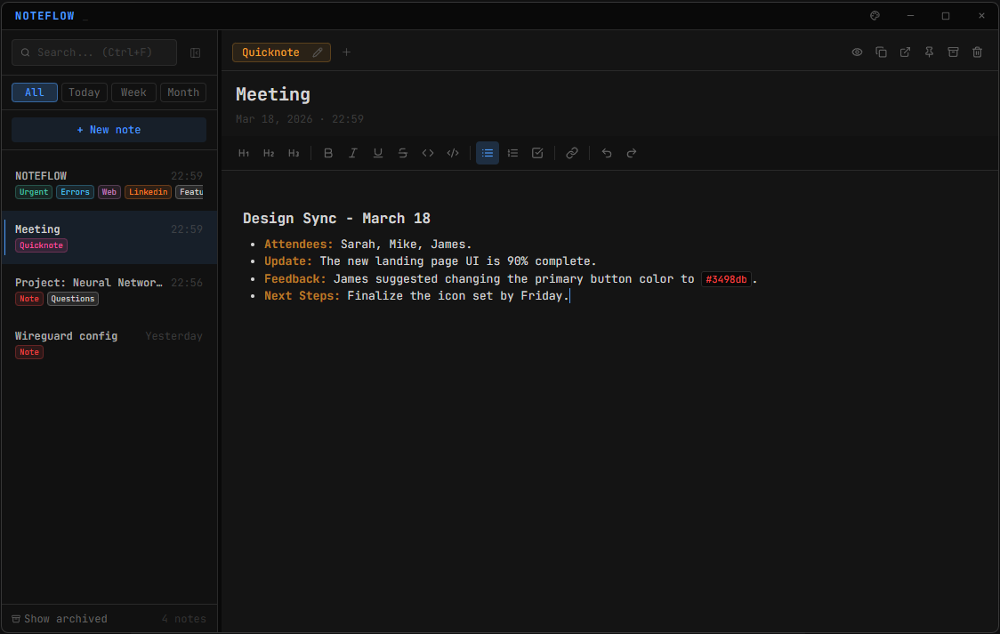

<div align="center">
  

  # NoteFlow

  **Fast notes for Windows & Linux developers.**
  *Local files, optional private GitHub sync. No telemetry. Just you and your thoughts.*

  [](https://github.com/yagoid/noteflow/releases/latest)
  [](LICENSE)

</div>

---

## What is NoteFlow?

NoteFlow is a keyboard-first, lightweight note-taking application for **Windows and Linux**.

Built specifically for software engineers and power users who need something faster than Notion and less clunky than the built-in OS alternatives. Scratch down a task list, jot code snippets, or capture a quick thought — and optionally access all of it from a terminal or headless server.

## Features

- **Markdown-first editor** — headings, bold, italic, inline code, code blocks, and interactive task lists with checkboxes.
- **Floating sticky notes** — launch any note as an independent floating window that stays on top while you work.
- **Note groups & deadlines** — organize notes into color-coded groups and attach due dates to any task.
- **Encrypted notes** — lock individual notes with a password; stored as ciphertext, no master key, no backdoor.
- **Private GitHub sync** — connect via Device Flow OAuth (no personal access tokens) and sync to a private repo you control. No third-party cloud, no telemetry.
- **Headless CLI** — a zero-dependency Node.js companion CLI that reads/writes the same notes directory. Works over SSH, on Raspberry Pi, in cron jobs, and with AI agents.
- **4 built-in themes** — Carbon, Midnight Blue, Tokyo Night, Arctic Day — with JetBrains Mono and minimal chrome.

## Download

Get the latest `.exe` (Windows 10/11) or `.deb` (Debian/Ubuntu) from the [Releases page](https://github.com/yagoid/noteflow/releases/latest).

*[Landing page](https://yagoid.github.io/noteflow/) · [CLI reference](https://yagoid.github.io/noteflow/cli.html)*

## CLI

A standalone CLI ships with every install and is also available for headless systems:

```bash
# Headless install (Linux / Raspberry Pi)
curl -fsSL https://raw.githubusercontent.com/yagoid/noteflow/main/cli/install-cli.sh | sudo bash

# Usage
noteflow add "fix CORS bug" --tag urgent
noteflow list --group backend --json
noteflow push
```

Full reference → [`cli/noteflow-cli/SKILL.md`](cli/noteflow-cli/SKILL.md) or [cli.html](https://yagoid.github.io/noteflow/cli.html)

### AI Agent Skill

Install the NoteFlow skill in your AI agent (Claude Code, Cursor, etc.) to interact with your notes from any conversation:

```bash
npx skills add yagoid/noteflow/cli/noteflow-cli
```

## Development

```bash
git clone https://github.com/yagoid/noteflow.git
cd noteflow
npm install
npm run dev
```

To build the installers:

```bash
npm run dist
# Generates: NoteFlow-X.Y.Z-Setup.exe (Windows) and noteflow_X.Y.Z_amd64.deb (Linux)
```

## License

MIT
